# RepairFlow — Projektdokumentation & BPMN-Prozessspezifikation

> **Rolle dieses Dokuments:** Teil 1 der SYAN-Fallstudie. Enthält Projektsteckbrief + die textuelle BPMN-2.0-Spezifikation aller 10 Geschäftsprozesse. Die finalen Kollaborationsdiagramme zeichnest du selbst im **Camunda Modeler / bpmn.io**; die hier gelieferten Mermaid-`flowchart`-Skizzen sind **Denkstützen für den Kontrollfluss**, kein BPMN-Ersatz (Mermaid kennt keine Pools/Message-Flows).
>
> **Konsistenz-Anker:** Klassennamen, Use-Case-Namen und Rollen sind identisch zu den UML-Teilen zu halten. Siehe [Namenskonventionen](#0-namenskonventionen-single-source-of-truth).

---

## 0. Namenskonventionen (Single Source of Truth)

Diese Namen sind über **alle** Teile (Doku, BPMN, Klassendiagramm, Use-Case-Diagramm, Zustandsautomat) **wortgleich** zu verwenden.

### Rollen / Pools
| Pool | Bedeutung |
|------|-----------|
| **Kunde** | Auftraggeber, gibt KVA frei, holt ab, reklamiert |
| **Werkstatt/Techniker** | nimmt an, diagnostiziert, repariert, meldet fertig |
| **Ersatzteil-Disposition** | prüft Verfügbarkeit, reserviert, bestellt, bucht Wareneingang, retourniert |
| **Lieferant** | externer Teilelieferant, liefert und bearbeitet Lieferanten-Reklamation |

### Klassen (18)
`Kunde`, `Reparaturauftrag`, `Geraet`, `Fehlerbefund/Diagnose`, `Kostenvoranschlag`, `KVA-Position`, `Reparaturschritt`, `Arbeitszeitbuchung`, `Techniker/Mitarbeiter`, `Filiale`, `Ersatzteil`, `Lagerbestand`, `Ersatzteil-Reservierung`, `Lieferantenbestellung`, `Bestellposition`, `Lieferant`, `Rechnung`, `Reklamation`.

### Use Cases (14)
Reparaturauftrag anlegen · Diagnosebefund erfassen · KVA erstellen · KVA freigeben/ablehnen (Kunde) · Ersatzteil-Verfügbarkeit prüfen · Ersatzteil reservieren · Lieferantenbestellung auslösen · Wareneingang buchen · Reparaturschritt/Arbeitszeit erfassen · Auftrag fertigmelden+Kunde benachrichtigen · Rechnung erstellen+Zahlung · Reklamation bearbeiten · Werkstatttermin planen+Techniker zuweisen · Nachbestellvorschlag bei Meldebestand.

### Zustandsautomat `Reparaturauftrag` (Leitfaden für den State-Machine-Teil)
`angenommen` → `in Diagnose` → `KVA offen` → `freigegeben` **|** `abgelehnt` → `Teile bestellt` → `in Reparatur` → `fertig` → `abgeholt`.

---

## 1. Projektsteckbrief

### 1.1 Szenario
Die **FixWerk GmbH** betreibt **4 Filialen** und repariert **Fahrräder/E-Bikes** sowie **Consumer-Elektronik**. Auftragsannahme, Fehlerdiagnose, Kostenvoranschlag (KVA) und die **filialübergreifende Ersatzteil-Beschaffung** laufen heute über **Papier, Excel und Telefon**. Folgen: Medienbrüche, kein zentraler Status je Auftrag, doppelte Datenerfassung, und — der schmerzhafteste Punkt — **Kunden werden nicht zuverlässig über KVA-Freigabe-Bedarf und Fertigstellung informiert**.

### 1.2 Projektziel
Einführung des Systems **RepairFlow**, das den **Reparaturauftrag als zentralen Zustandsautomaten** führt und alle vier Rollen (Kunde, Werkstatt/Techniker, Ersatzteil-Disposition, Lieferant) über definierte Nachrichten koppelt. Kernnutzen:

- **Durchgängiger Auftragsstatus** statt Papier/Excel/Telefon (Single Source of Truth pro `Reparaturauftrag`).
- **Aktive Kundenkommunikation** an den Statusübergängen `KVA offen` (Freigabe anfordern) und `fertig` (Abhol-Benachrichtigung).
- **Filialübergreifende Bestandssicht** über alle 4 `Filiale`n, damit Teile per interner Umlagerung statt teurer Sofortbestellung beschafft werden.
- **Nachvollziehbare Kalkulation** über `Kostenvoranschlag`/`KVA-Position` und **verursachungsgerechte Abrechnung** über `Arbeitszeitbuchung`.

### 1.3 Systemkontext (Kontextabgrenzung)
RepairFlow ist das **System-in-Scope**. Externe Kommunikationspartner:

| Externer Partner | Austausch mit RepairFlow |
|------------------|---------------------------|
| **Kunde** | Auftragsdaten, KVA (Freigabe/Ablehnung), Abhol-Benachrichtigung, Rechnung/Zahlung, Reklamation |
| **Lieferant** | `Lieferantenbestellung`, Auftragsbestätigung, Lieferung/Wareneingang, Retoure/Lieferanten-Reklamation |
| **Filialnetz (4 Filialen)** | interner Bestand/Umlagerung — im System abgebildet, kein externer Aktor |

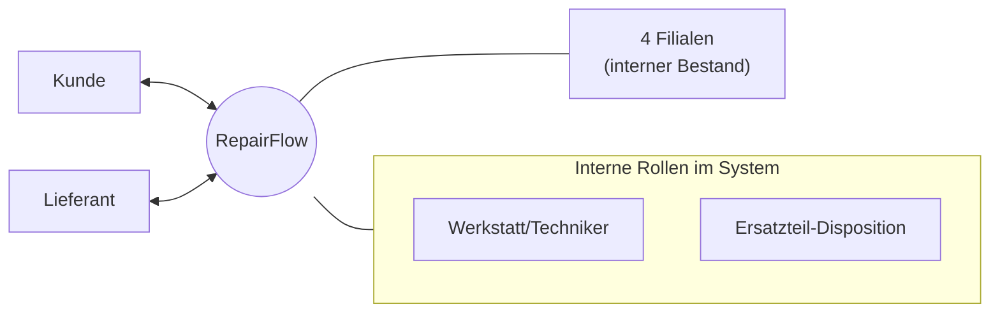

### 1.4 Rollen im Detail
- **Kunde** — bringt `Geraet`, entscheidet über `Kostenvoranschlag`, zahlt `Rechnung`, stellt `Reklamation`.
- **Werkstatt/Techniker** (`Techniker/Mitarbeiter`) — Annahme, `Fehlerbefund/Diagnose`, `Reparaturschritt`/`Arbeitszeitbuchung`, Fertigmeldung.
- **Ersatzteil-Disposition** — `Ersatzteil-Verfügbarkeit`, `Ersatzteil-Reservierung`, `Lieferantenbestellung`, Wareneingang, Retoure.
- **Lieferant** — externe Beschaffung von `Ersatzteil`en, Retouren-/Reklamationsabwicklung.

---

## 2. BPMN-Prozessspezifikationen (10 Prozesse)

**Lesehilfe je Prozess:** *Zweck · Pools/Lanes · Trigger (Start-Event) · Aktivitäten-Sequenz mit Gateways · Datenobjekte · End-Events · Message-Flows.*
Legende der Skizzen: `([Start/Ende])` = Event, `[Aktivität]` = Task, `{XOR}` = exklusives Gateway, `{{AND}}` = paralleles Gateway.

---

### Prozess 1 — Auftragsannahme + Geräteregistrierung
**Zweck:** Kunde bringt Gerät, Werkstatt legt Auftrag an → Zustand `angenommen`.
**Pools/Lanes:** Kunde · Werkstatt/Techniker.
**Trigger (Start-Event):** Nachrichten-Start „Kunde erscheint mit Gerät" (Message Start).
**Datenobjekte:** `Kunde`, `Geraet`, `Reparaturauftrag`.
**Aktivitäten-Sequenz:**
1. (Werkstatt) Kundendaten aufnehmen → `Kunde` anlegen/finden.
2. XOR **Bestandskunde?** → *ja*: Datensatz laden · *nein*: `Kunde` neu anlegen.
3. `Geraet` registrieren (Typ Fahrrad/E-Bike/Elektronik, Serien-/Rahmennummer).
4. Symptomschilderung des Kunden aufnehmen.
5. Sichtprüfung, Zubehör/Zustand dokumentieren.
6. XOR **Sofort-Sichtdiagnose möglich?** → beeinflusst Priorität (kein Prozessabbruch).
7. `Reparaturauftrag` anlegen, Status **`angenommen`** setzen.
8. Auftragsnummer/Annahmebeleg erzeugen.
9. Annahmebeleg an Kunde aushändigen *(Message-Flow → Kunde)*.
10. Auftrag an Prozess 2 (Diagnose) übergeben.

**End-Event:** „Auftrag angenommen" → löst Prozess 2 aus.

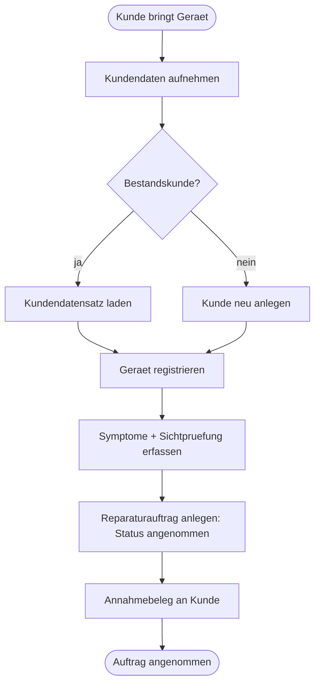

---

### Prozess 2 — Fehlerdiagnose
**Zweck:** Techniker ermittelt Fehlerursache → Zustand `in Diagnose`.
**Pools/Lanes:** Werkstatt/Techniker (ggf. Lane Diagnose-Arbeitsplatz).
**Trigger:** End-Event von Prozess 1 (Auftrag `angenommen`).
**Datenobjekte:** `Reparaturauftrag`, `Geraet`, `Fehlerbefund/Diagnose`.
**Aktivitäten-Sequenz:**
1. Auftrag in Status **`in Diagnose`** überführen.
2. `Techniker/Mitarbeiter` zuweisen (Verweis Prozess 9).
3. Funktionstest/Messung durchführen.
4. XOR **Fehler reproduzierbar?** → *nein*: erweiterte Prüfung · *ja*: weiter.
5. Ursache eingrenzen, betroffene Baugruppe bestimmen.
6. `Fehlerbefund/Diagnose` dokumentieren.
7. Benötigte `Ersatzteil`e vorläufig identifizieren.
8. XOR **Reparatur wirtschaftlich sinnvoll / Gerät reparierbar?**
   - *nein*: „wirtschaftlicher Totalschaden" vermerken → Kunde informieren → Ende (kein KVA).
   - *ja*: weiter.
9. Aufwandsschätzung (Arbeitswerte) grob festhalten.
10. Diagnose abschließen → Übergabe an Prozess 3.

**End-Events:** „Diagnose ok → KVA anstoßen" **|** „nicht reparierbar → Kunde informiert".

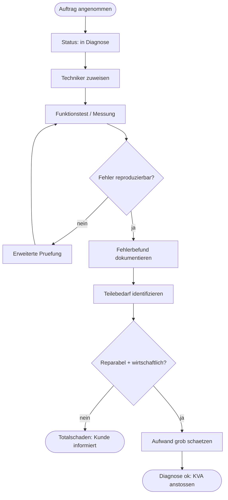

---

### Prozess 3 — KVA-Erstellung + Kundenfreigabe
**Zweck:** Kostenvoranschlag erstellen, Kunde freigeben lassen → Zustand `KVA offen` → `freigegeben`/`abgelehnt`.
**Pools/Lanes:** Werkstatt/Techniker · Kunde.
**Trigger:** End-Event „Diagnose ok" (Prozess 2).
**Datenobjekte:** `Kostenvoranschlag`, `KVA-Position`, `Fehlerbefund/Diagnose`, `Reparaturauftrag`.
**Aktivitäten-Sequenz:**
1. `Kostenvoranschlag` anlegen (Bezug zu `Reparaturauftrag`).
2. Je Arbeit/Teil eine `KVA-Position` erfassen (Teile + Arbeitswerte).
3. Summen/Steuer kalkulieren.
4. Auftrag in Status **`KVA offen`** setzen.
5. KVA an Kunde senden *(Message-Flow → Kunde)*, Rückmeldefrist starten.
6. **Ereignisbasiertes Gateway** — auf Kundenreaktion warten:
   - Nachricht **Freigabe** empfangen,
   - Nachricht **Ablehnung** empfangen,
   - **Timer** (Frist abgelaufen).
7. XOR-Auswertung der Reaktion:
   - *Freigabe*: Status **`freigegeben`** → Prozess 4 anstoßen.
   - *Ablehnung*: Status **`abgelehnt`** → Gerät zur Abholung, ggf. Diagnosepauschale.
   - *Timer/keine Reaktion*: erneut nachfassen → erneut warten (Schleife, begrenzt).
8. (Kunde-Lane) KVA prüfen und entscheiden.
9. Entscheidung im `Reparaturauftrag` protokollieren.
10. Übergabe (freigegeben → P4) bzw. Abschluss (abgelehnt → Abholung/P7-Diagnosepauschale).

**End-Events:** „KVA freigegeben" **|** „KVA abgelehnt".

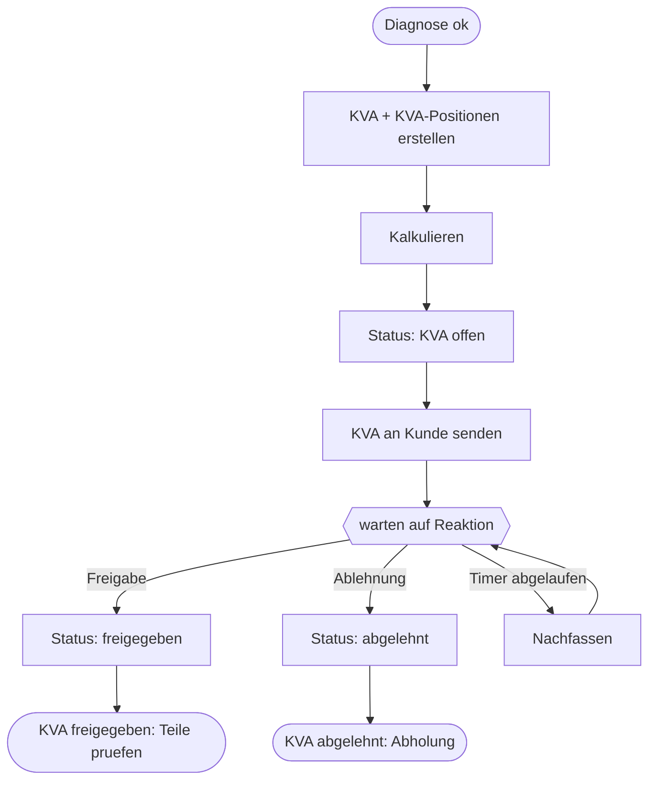

---

### Prozess 4 — Ersatzteil-Verfügbarkeit + Reservierung (filialübergreifend)
**Zweck:** Prüfen, ob Teile im eigenen/anderen Filialbestand liegen, und reservieren.
**Pools/Lanes:** Werkstatt/Techniker · Ersatzteil-Disposition.
**Trigger:** End-Event „KVA freigegeben" (Prozess 3).
**Datenobjekte:** `Ersatzteil`, `Lagerbestand`, `Filiale`, `Ersatzteil-Reservierung`, `Reparaturauftrag`.
**Aktivitäten-Sequenz:**
1. Benötigte `Ersatzteil`e aus KVA/Diagnose übernehmen.
2. **AND-Split** — je Teil parallel prüfen (Schleife über Teileliste).
3. `Lagerbestand` der eigenen `Filiale` prüfen.
4. XOR **eigener Bestand ausreichend?**
   - *ja*: `Ersatzteil-Reservierung` in eigener Filiale anlegen.
   - *nein*: Bestand der 3 anderen `Filiale`n prüfen.
5. XOR **in anderer Filiale verfügbar?**
   - *ja*: Umlagerung anfordern + `Ersatzteil-Reservierung` anlegen.
   - *nein*: Teil als „zu bestellen" markieren.
6. **AND-Join** — Teilprüfungen zusammenführen.
7. XOR **alle Teile beschafft/reserviert?**
   - *ja*: Auftrag Richtung Reparatur (Status später `Teile bestellt`/verfügbar) → Prozess 6.
   - *nein*: Fehlteile bündeln → Prozess 5 (Bestellung).
8. Reservierungen bestätigen und `Lagerbestand` verbuchen (reserviert).
9. Ggf. Meldebestand-Prüfung anstoßen (Prozess-Referenz Nachbestellvorschlag).
10. Ergebnis am `Reparaturauftrag` dokumentieren.

**End-Events:** „Alle Teile verfügbar → Reparatur" **|** „Fehlteile → Bestellung".

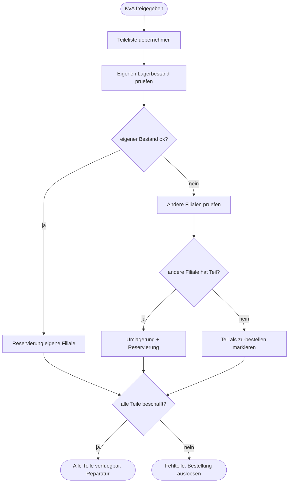

---

### Prozess 5 — Ersatzteil-Bestellung beim Lieferanten
**Zweck:** Fehlende Teile beim Lieferanten bestellen und Wareneingang vorbereiten → Zustand `Teile bestellt`.
**Pools/Lanes:** Ersatzteil-Disposition · Lieferant.
**Trigger:** End-Event „Fehlteile" (Prozess 4) *oder* Nachbestellvorschlag (Prozess-Referenz).
**Datenobjekte:** `Lieferantenbestellung`, `Bestellposition`, `Lieferant`, `Ersatzteil`, `Reparaturauftrag`.
**Aktivitäten-Sequenz:**
1. Fehlteile bündeln, passenden `Lieferant` wählen.
2. `Lieferantenbestellung` mit `Bestellposition`en anlegen.
3. XOR **Freigabe/Budget nötig?** → ggf. intern freigeben.
4. Bestellung an `Lieferant` senden *(Message-Flow → Lieferant)*.
5. Auftrag ggf. auf **`Teile bestellt`** setzen.
6. **(Lieferant-Lane)** Bestellung prüfen, Auftragsbestätigung senden *(Message-Flow → Disposition)*.
7. **Empfangendes Zwischen-Event** — auf Bestätigung/Liefertermin warten.
8. XOR **bestätigt & lieferbar?**
   - *nein*: alternativen `Lieferant`/Ersatzteil suchen → zurück zu Schritt 1.
   - *ja*: Liefertermin am Auftrag hinterlegen.
9. Lieferung erwarten (Zwischen-Event Wareneingang) → Übergabe an Prozess-Schritt „Wareneingang buchen".
10. Kunde bei relevanter Verzögerung informieren *(Message-Flow → Kunde)*.

**End-Event:** „Bestellung ausgelöst, Lieferung erwartet".

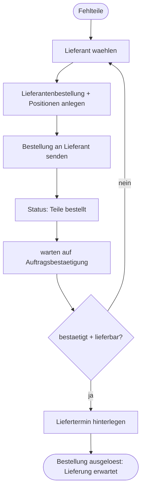

---

### Prozess 6 — Reparaturdurchführung + Arbeitszeiterfassung
**Zweck:** Reparatur ausführen, Arbeitszeit buchen → Zustand `in Reparatur` → `fertig`.
**Pools/Lanes:** Werkstatt/Techniker.
**Trigger:** „Alle Teile verfügbar" (P4) *oder* Wareneingang gebucht (P5/„Wareneingang buchen").
**Datenobjekte:** `Reparaturschritt`, `Arbeitszeitbuchung`, `Ersatzteil-Reservierung`, `Techniker/Mitarbeiter`, `Reparaturauftrag`.
**Aktivitäten-Sequenz:**
1. Auftrag in Status **`in Reparatur`** setzen.
2. Reservierte `Ersatzteil`e aus `Lagerbestand` entnehmen (Reservierung auflösen).
3. Nächsten `Reparaturschritt` starten.
4. `Arbeitszeitbuchung` (Start/Stop) je Schritt erfassen.
5. Schritt ausführen und dokumentieren.
6. XOR **weitere Reparaturschritte offen?** → *ja*: zurück zu 3 (Schleife).
7. XOR **unerwarteter Zusatzbefund / Mehraufwand?**
   - *ja*: Nachtrags-KVA nötig → Rücksprung Prozess 3 *(Message-Flow → Kunde)*.
   - *nein*: weiter.
8. Endkontrolle/Funktionstest.
9. XOR **Qualität ok?** → *nein*: Nacharbeit (zurück zu 3) · *ja*: weiter.
10. Auftrag auf **`fertig`** setzen → Übergabe an Prozess 7 (Fertigmeldung).

**End-Event:** „Reparatur abgeschlossen (fertig)".

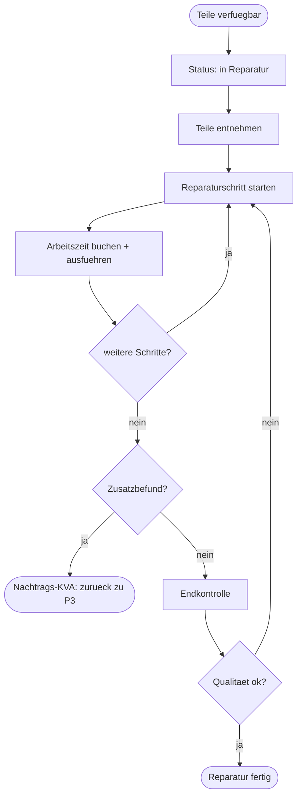

---

### Prozess 7 — Abholung + Rechnung + Zahlung
**Zweck:** Kunde benachrichtigen, abrechnen, Übergabe → Zustand `abgeholt`.
**Pools/Lanes:** Werkstatt/Techniker · Kunde.
**Trigger:** End-Event „Reparatur fertig" (Prozess 6).
**Datenobjekte:** `Rechnung`, `Reparaturauftrag`, `Kostenvoranschlag`, `Arbeitszeitbuchung`.
**Aktivitäten-Sequenz:**
1. Abhol-Benachrichtigung an Kunde senden *(Message-Flow → Kunde)*.
2. `Rechnung` aus KVA + tatsächlichen `Arbeitszeitbuchung`en erstellen.
3. **Empfangendes Event** — auf Kunde/Abholung warten.
4. (Kunde) erscheint zur Abholung.
5. Gerät + Rechnung übergeben.
6. XOR **Zahlungsart?** → bar / Karte / Rechnung(Ziel).
7. Zahlung erfassen.
8. XOR **Zahlung erfolgt/zugesagt?** → *nein*: Übergabe zurückstellen (Schleife) · *ja*: weiter.
9. Auftrag auf **`abgeholt`** setzen, Auftrag schließen.
10. Reservierungen/Restbestände final verbuchen.

**End-Event:** „Auftrag abgeschlossen (abgeholt)".

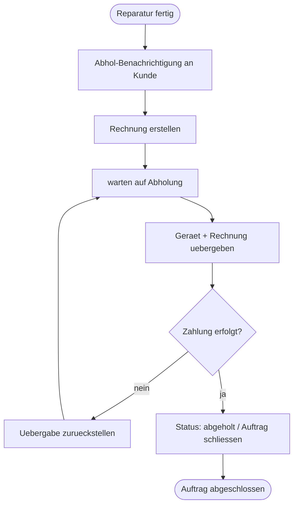

---

### Prozess 8 — Reklamation / Gewährleistung
**Zweck:** Kundenreklamation nach Abholung prüfen und abwickeln.
**Pools/Lanes:** Kunde · Werkstatt/Techniker.
**Trigger:** Message-Start „Kunde meldet Mangel" (nach `abgeholt`).
**Datenobjekte:** `Reklamation`, `Reparaturauftrag`, `Fehlerbefund/Diagnose`, `Rechnung`.
**Aktivitäten-Sequenz:**
1. `Reklamation` erfassen (Bezug zu `Reparaturauftrag`/`Rechnung`).
2. Gerät annehmen, Mangel dokumentieren.
3. Ursache prüfen (Zusammenhang mit vorheriger Reparatur?).
4. XOR **Gewährleistungsfall?**
   - *ja*: kostenfreie Nacharbeit veranlassen.
   - *nein*: neuen kostenpflichtigen Vorgang/KVA anbieten *(Message-Flow → Kunde)*.
5. XOR (bei Ablehnung des kostenpflichtigen Angebots) → Reklamation abschließen ohne Reparatur.
6. Nacharbeit einplanen (Verweis Prozess 9) und durchführen (Verweis Prozess 6).
7. XOR **Teilfehler beim Lieferantenteil?** → *ja*: Prozess 10 anstoßen (Retoure).
8. Ergebnis dokumentieren, Kunde informieren *(Message-Flow → Kunde)*.
9. Reklamation-Status setzen (anerkannt/abgelehnt/erledigt).
10. `Reklamation` abschließen.

**End-Events:** „Reklamation erledigt (Gewährleistung)" **|** „Reklamation abgelehnt".

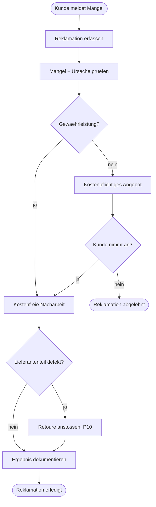

---

### Prozess 9 — Terminplanung + Werkstattauslastung
**Zweck:** Reparatur einplanen und Techniker zuweisen (Kapazitätssteuerung).
**Pools/Lanes:** Werkstatt/Techniker (Lane Werkstattleitung/Disposition intern).
**Trigger:** Auftrag benötigt Slot (aus P2/P6) *oder* Nacharbeit aus P8.
**Datenobjekte:** `Reparaturauftrag`, `Techniker/Mitarbeiter`, `Filiale`, `Reparaturschritt`.
**Aktivitäten-Sequenz:**
1. Offene/eingeplante Aufträge der `Filiale` sammeln.
2. Aufwand/Priorität je Auftrag bewerten.
3. Werkstattauslastung/Kapazität prüfen.
4. XOR **Kapazität frei?**
   - *nein*: Termin verschieben / auf andere `Filiale` verweisen → Kunde informieren *(Message-Flow → Kunde)*.
   - *ja*: weiter.
5. Passenden `Techniker/Mitarbeiter` (Qualifikation) auswählen.
6. Zeitfenster/Werkstatttermin festlegen.
7. Auftrag dem Techniker zuweisen.
8. XOR **Kundentermin erforderlich?** → *ja*: Termin mit Kunde abstimmen *(Message-Flow → Kunde)*.
9. Einplanung im `Reparaturauftrag` festhalten.
10. Plan an ausführende Prozesse (P2/P6) übergeben.

**End-Event:** „Auftrag eingeplant + Techniker zugewiesen".

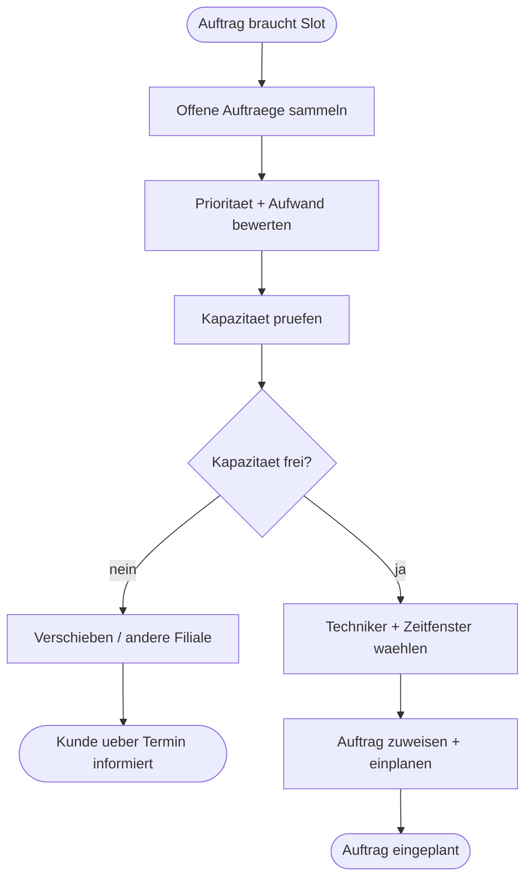

---

### Prozess 10 — Ersatzteil-Retoure + Lieferanten-Reklamation
**Zweck:** Defektes/falsches Lieferantenteil zurücksenden und reklamieren.
**Pools/Lanes:** Ersatzteil-Disposition · Lieferant.
**Trigger:** Auslöser aus P8 (defektes Teil) *oder* Wareneingang mit Mangel (aus P5).
**Datenobjekte:** `Ersatzteil`, `Lieferantenbestellung`, `Bestellposition`, `Lieferant`, `Lagerbestand`.
**Aktivitäten-Sequenz:**
1. Retourengrund erfassen (defekt / falsch / Überlieferung).
2. Betroffene `Bestellposition`/`Lieferantenbestellung` referenzieren.
3. RMA/Retoure beim `Lieferant` anfordern *(Message-Flow → Lieferant)*.
4. **Empfangendes Event** — auf RMA-Freigabe warten.
5. XOR **RMA genehmigt?** → *nein*: eskalieren / Frist setzen (Schleife) · *ja*: weiter.
6. Teil zurücksenden, `Lagerbestand` korrigieren.
7. XOR **Ersatz oder Gutschrift?**
   - *Ersatz*: Ersatzlieferung erwarten → Wareneingang buchen (Verweis P5).
   - *Gutschrift*: Gutschrift verbuchen.
8. **(Lieferant-Lane)** Retoure prüfen, Ersatz/Gutschrift senden *(Message-Flow → Disposition)*.
9. XOR **Reparatur wartet auf dieses Teil?** → *ja*: P6 nach Ersatzeingang fortsetzen.
10. Retoure/Reklamation abschließen und dokumentieren.

**End-Events:** „Ersatz erhalten (Reparatur fortsetzbar)" **|** „Gutschrift verbucht".

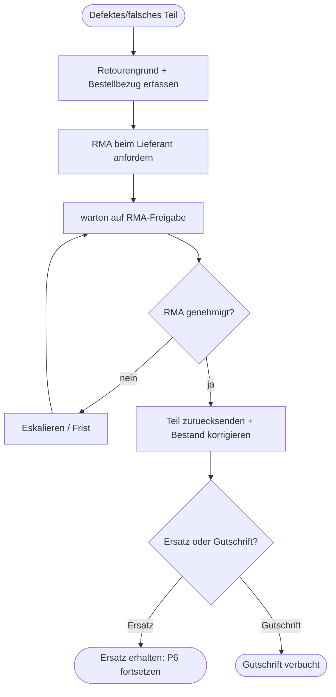

---

## 3. Hinweise zur syntaktisch korrekten BPMN-2.0-Umsetzung (Camunda Modeler)

### 3.1 Pools & Lanes
- **Vier Pools** anlegen: `Kunde`, `Werkstatt/Techniker`, `Ersatzteil-Disposition`, `Lieferant`. Nicht jeder Prozess nutzt alle vier — pro Diagramm nur die beteiligten Pools zeichnen.
- Der **ausführende Pool** (RepairFlow-Seite) bekommt den ausmodellierten Prozess; `Kunde` und `Lieferant` werden meist als **Black-Box-Pool** (zugeklappt, ohne inneren Fluss) modelliert — nach außen kommuniziert man nur per Message-Flow.
- Lanes innerhalb eines Pools nur, wenn du Rollen im selben Pool trennst (z. B. Annahme vs. Diagnose-Arbeitsplatz).

### 3.2 Sequence-Flow vs. Message-Flow (häufigster Fehler!)
- **Sequence-Flow** (durchgezogener Pfeil) verbindet **nur** Elemente **innerhalb desselben Pools**. Er darf **nie** eine Pool-Grenze überqueren.
- **Message-Flow** (gestrichelter Pfeil mit offenem Kreis am Start, Pfeilspitze am Ziel) verbindet **verschiedene Pools** — z. B. „KVA an Kunde senden", „Bestellung an Lieferant senden", „Abhol-Benachrichtigung".
- Jeder Message-Flow braucht ein sendendes und ein empfangendes Element (Task, Message-Event oder Black-Box-Pool-Rand).

### 3.3 Gateways korrekt einsetzen
- **XOR (exklusiv, Raute mit „×")**: genau **ein** ausgehender Pfad. Für „entweder/oder"-Entscheidungen (Bestandskunde?, KVA freigegeben?, Zahlung erfolgt?). Jeder ausgehende Flow bekommt eine **Bedingung**, plus optional ein **Default-Flow**.
- **AND (parallel, Raute mit „+")**: **alle** Pfade laufen gleichzeitig. In P4 für die parallele Teile-Prüfung; **Split und Join paaren** (jeder AND-Split braucht einen AND-Join, sonst hängt der Token).
- **Ereignisbasiertes Gateway (Raute mit Pentagon)**: in P3 vor dem Warten auf Kundenreaktion — der erste eintreffende Event-Pfad (Freigabe / Ablehnung / Timer) gewinnt.
- **Regel:** Gateways **entscheiden/routen nur** — sie führen keine Arbeit aus. Beschriftungen in Frageform am Gateway, Antworten (`ja`/`nein`) an den ausgehenden Flows.

### 3.4 Events
- **Start-Event:** genau eines pro ausmodelliertem Prozess. Message-Start (Kunde/Lieferant löst aus) vs. schlichter Start (Folgeprozess intern).
- **Zwischen-Events:** empfangende Message-Events (Auftragsbestätigung, RMA-Freigabe) und **Timer** (Frist KVA, Nachfassen).
- **End-Events:** jeden Ausgang sauber terminieren; unterschiedliche Ausgänge = unterschiedliche End-Events (z. B. „freigegeben" vs. „abgelehnt"). Message-End, wenn der Abschluss eine Nachricht nach außen ist.

### 3.5 Datenobjekte
- `Reparaturauftrag`, `Kostenvoranschlag`, `Rechnung` etc. als **Data Objects** an die erzeugenden/lesenden Tasks hängen (gepunkteter Assoziationspfeil). Das macht die Verbindung zum Klassendiagramm sichtbar — **gleiche Namen** verwenden.

### 3.6 Prozessübergreifende Kopplung
Die 10 Prozesse bilden **eine Auftragsreise** entlang des Zustandsautomaten. Kopple sie über **Link-Events** oder benannte **Message-/Signal-Events** (P1→P2→P3→P4→P5/P6→P7; P8/P9/P10 als angebundene Teilprozesse). Für die Fallstudie genügt es, die Übergänge über gleichnamige Start-/End-Events kenntlich zu machen — im Bericht auf den gemeinsamen `Reparaturauftrag`-Zustandsautomaten (Abschnitt 0) verweisen.

### 3.7 Validierung vor Abgabe (Checkliste)
- [ ] Jeder Pool: höchstens ein Start-Event, alle Pfade enden in End-Events.
- [ ] Kein Sequence-Flow über Pool-Grenzen; jede Cross-Pool-Kommunikation ist Message-Flow.
- [ ] Jeder AND-Split hat einen AND-Join.
- [ ] Jedes XOR-Gateway hat beschriftete Bedingungen + Default.
- [ ] Datenobjekt-Namen = Klassennamen aus Abschnitt 0.
- [ ] Aktivitäten in **Verb-Objekt-Form** benannt („KVA erstellen", nicht „KVA").
