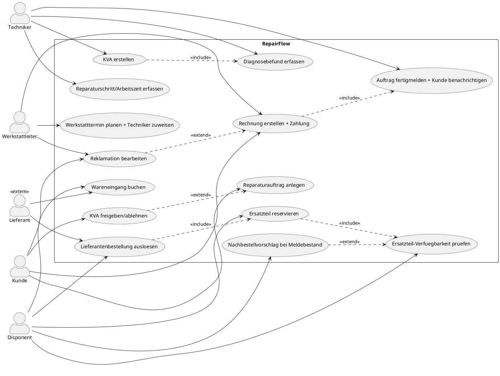

# RepairFlow — Use-Case-Diagramm

Deliverable 2 der SYAN-Fallstudie **RepairFlow** (Werkstatt-Management-System der FixWerk GmbH). Zeichenwerkzeug im Kurs: **Visual Paradigm**. Dieses Dokument liefert den PlantUML-Code (renderbar in VP über *Diagram > Import > PlantUML* oder auf plantuml.com) plus eine Erklärung der Aktoren und der wichtigsten `<<include>>`/`<<extend>>`-Beziehungen.

---

## PlantUML-Code

> Hinweis zu Doppel-Beziehungen: `UC7 → UC6` steht oben zweimal (einmal `<<include>>`, einmal `<<extend>>`) nur zur Illustration beider Optionen. **Wähle beim Zeichnen genau eine** — fachlich sauberer ist `<<include>>` (jede Lieferantenbestellung setzt eine Reservierung des zu bestellenden Teils voraus). Lösche vor dem Rendern in VP die `<<extend>>`-Zeile zwischen UC7 und UC6, damit keine widersprüchliche Doppelkante entsteht.

---

## Aktor-Rollen

| Aktor | Typ | Rolle im System |
|-------|-----|-----------------|
| **Kunde** | primär, extern | Bringt Gerät, erteilt Auftrag, gibt den **Kostenvoranschlag (KVA)** frei oder lehnt ihn ab, zahlt die Rechnung, meldet ggf. eine Reklamation. Löst den Prozess aus, sieht aber nur die Kundensicht (Freigabe, Abholung, Zahlung). |
| **Techniker** | primär, intern | Führt die fachliche Arbeit aus: Diagnose, KVA-Inhalt, Reparaturschritte + Arbeitszeiterfassung, Fertigmeldung. Bewegt den Reparaturauftrag durch die technischen Zustände `in Diagnose → in Reparatur → fertig`. |
| **Disponent** | primär, intern | Zuständig für die **Ersatzteil-Disposition** über alle vier Filialen: Verfügbarkeit prüfen, filialübergreifend reservieren, Lieferantenbestellungen auslösen, Wareneingang buchen, Nachbestellung bei Meldebestand. |
| **Werkstattleiter** | primär, intern | Steuert Auslastung und Abschluss: plant Werkstatttermine und weist Techniker zu, verantwortet Rechnungsstellung/Zahlung und die Bearbeitung von Reklamationen/Gewährleistung. |
| **Lieferant** | sekundär, extern | Empfängt Bestellungen und liefert Ersatzteile. Kein interner Benutzer — nimmt am System nur über die Schnittstellen *Bestellung auslösen* und *Wareneingang* teil. |

Warum diese Aufteilung: Die vier internen Aktoren spiegeln exakt die vier Pools/Rollen des Szenarios (Werkstatt/Techniker, Disposition + der steuernde Werkstattleiter als eigene Verantwortung, plus Kunde und Lieferant extern). So bleibt das Diagramm konsistent zum BPMN-Teil.

## Wichtigste Beziehungen (Begründung)

- **`KVA erstellen` `<<include>>` `Diagnosebefund erfassen`** — ein KVA ist ohne vorliegenden Fehlerbefund nicht sinnvoll erstellbar; die Diagnose ist Pflichtbestandteil, kein optionaler Zusatz.
- **`Ersatzteil reservieren` `<<include>>` `Ersatzteil-Verfuegbarkeit pruefen`** — reserviert wird nur, was der Verfügbarkeits-Check zuvor lokalisiert hat (filialübergreifend). Die Prüfung ist immer Teil der Reservierung.
- **`Lieferantenbestellung ausloesen` `<<include>>` `Ersatzteil reservieren`** — die Bestellung beim Lieferanten setzt voraus, dass das benötigte Teil dem Auftrag zugeordnet/reserviert ist.
- **`Rechnung erstellen + Zahlung` `<<include>>` `Auftrag fertigmelden + Kunde benachrichtigen`** — die Rechnung entsteht als fester Bestandteil des Abschlusses.
- **`KVA freigeben/ablehnen` `<<extend>>` `Reparaturauftrag anlegen`** — die Freigabe ist ein *bedingter* Zwischenschritt: nur wenn ein KVA nötig ist, erweitert dieser Entscheidungspunkt den Auftrag. Bei Ablehnung endet der Auftrag früh (Zustand `abgelehnt`).
- **`Reklamation bearbeiten` `<<extend>>` `Rechnung erstellen + Zahlung`** — Reklamation/Gewährleistung tritt nur im Ausnahmefall nach Abschluss auf und erweitert daher den regulären Ablauf.
- **`Nachbestellvorschlag bei Meldebestand` `<<extend>>` `Ersatzteil-Verfuegbarkeit pruefen`** — nur wenn der Lagerbestand den Meldebestand unterschreitet, wird die Prüfung um einen Nachbestellvorschlag erweitert.

**Faustregel zur Notation:** `<<include>>` = *immer* ausgeführter Teilschritt (Basis-UC ruft eingeschlossenen UC unbedingt auf). `<<extend>>` = *bedingt/optional* eingefügtes Verhalten am Erweiterungspunkt des Basis-UC.

## Bezug zum Rest der Fallstudie

- **BPMN (Teil 1):** Die 14 Use Cases mappen auf die 10 Geschäftsprozesse — z.B. UC5–UC8 bilden Prozess 4 (Verfügbarkeit/Reservierung) und 5 (Bestellung) ab.
- **Klassendiagramm (späterer Teil):** Jeder UC operiert auf den Klassen aus dem Kontext — z.B. `KVA erstellen` erzeugt einen `Kostenvoranschlag` mit `KVA-Position`en; `Ersatzteil reservieren` legt eine `Ersatzteil-Reservierung` auf einem `Lagerbestand` an.
- **Zustandsautomat:** UC1→UC2→UC3→UC4→UC7→UC9→UC10→UC11 folgen den Auftrags-Zuständen `angenommen → in Diagnose → KVA offen → freigegeben → Teile bestellt → in Reparatur → fertig → abgeholt`.
