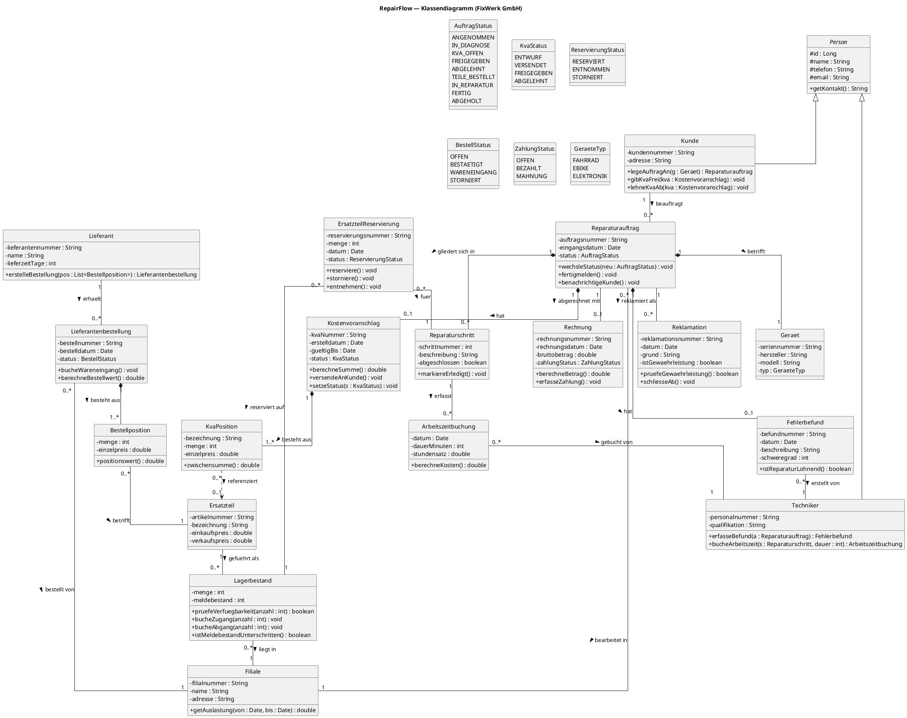

# RepairFlow — Klassendiagramm (Teil 3)

Werkstatt-Management-System der **FixWerk GmbH** (4 Filialen, Fahrrad/E-Bike + Consumer-Elektronik). Dieses Deliverable ist das **UML-Klassendiagramm** der Fachdomäne. Der Reparaturauftrag ist als Zustandsautomat modelliert (`AuftragStatus`-Enum) — das ist das Herzstück der Domäne.

Werkzeug für die Endfassung: **Visual Paradigm**. Der PlantUML-Code unten ist der übernehmbare Zwischenstand.

---

## PlantUML-Code

---

## Erklärung der zentralen Beziehungen

**Warum Komposition bei `Reparaturauftrag *-- KVA / Geraet / Reparaturschritt / Fehlerbefund`?**
Diese Teile haben ohne den Auftrag keine eigenständige Existenz: Ein Kostenvoranschlag, ein Fehlerbefund oder ein Reparaturschritt macht isoliert keinen Sinn — sie werden mit dem Auftrag angelegt und (bei Löschung) mit ihm entsorgt. Das ist die klassische **Ganzes-Teil-mit-Existenzabhängigkeit** → gefüllte Raute (Komposition).
Das `Geraet` ist bewusst als Komposition modelliert, weil in dieser Domäne ein Auftrag genau ein registriertes Gerät fasst; wolltest du Geräte-Historie über mehrere Aufträge führen, wäre es eine Assoziation — das ist eine benennbare Design-Entscheidung, keine Zwangslage.

**Warum Komposition bei `KVA *-- KVA-Position` und `Lieferantenbestellung *-- Bestellposition`?**
Positionen sind reine Teilobjekte ihres Belegs (Rechnungs-/Bestellzeilen-Muster). Eine KVA-Position ohne ihren KVA ist sinnlos → Komposition mit `1..*` (ein KVA hat mindestens eine Position).

**Warum ist `Lagerbestand` eine eigene Klasse und nicht ein Attribut von `Ersatzteil`?**
Das ist der Kern der **filialübergreifenden Beschaffung**. Ein `Ersatzteil` ist ein Stammdatum (Artikelnummer, Preis) — dasselbe Teil existiert einmal. Der Bestand ist aber **pro Filiale** unterschiedlich. Deshalb: `Ersatzteil "1" -- "0..*" Lagerbestand` und `Lagerbestand "0..*" -- "1" Filiale`. Ein `Lagerbestand`-Objekt = „Menge von Artikel X in Filiale Y". Nur so lässt sich Prozess 4 (Verfügbarkeit filialübergreifend prüfen) sauber abbilden: man iteriert über alle Lagerbestände desselben Ersatzteils.

**Warum `ErsatzteilReservierung` als eigene Klasse (Reifikation)?**
Eine Reservierung ist eine Beziehung mit eigenen Attributen (Menge, Datum, Status) und eigenem Lebenszyklus (reservieren → entnehmen/stornieren). Solche „Beziehungen mit Daten" werden als eigene Klasse ausmodelliert (assoziative Klasse). Sie hängt an genau einem `Lagerbestand` (welche Filiale gibt die Teile her) und an dem `Reparaturschritt`, der sie braucht.

**Warum Vererbung `Person <|-- Kunde, Techniker`?**
`Kunde` und `Techniker` teilen sich Kontaktdaten (Name, Telefon, E-Mail) und `getKontakt()`. Das rechtfertigt eine abstrakte Oberklasse `Person`. `Filiale` und `Lieferant` erben **nicht** — sie sind Organisationen, keine Personen, teilen keinen Kontakt-Kern in dieser Domäne.

---

## Warum welche Methode wo sitzt (Zuständigkeitsprinzip)

Methoden liegen bei der Klasse, die die dafür nötigen Daten **besitzt** (Information-Expert-Prinzip):

| Methode | Klasse | Begründung |
|---|---|---|
| `wechsleStatus()`, `fertigmelden()`, `benachrichtigeKunde()` | `Reparaturauftrag` | Der Auftrag hält `status : AuftragStatus`. Der Zustandsautomat gehört genau dorthin, wo der Zustand liegt. |
| `berechneSumme()`, `versendeAnKunde()` | `Kostenvoranschlag` | Der KVA kennt seine `KvaPosition`en → er allein kann summieren. |
| `zwischensumme()` | `KvaPosition` | Menge × Einzelpreis ist Wissen der Position; der KVA aggregiert nur. |
| `pruefeVerfuegbarkeit()`, `bucheZugang/Abgang()`, `istMeldebestandUnterschritten()` | `Lagerbestand` | Menge und Meldebestand liegen hier — Verfügbarkeit ist keine Eigenschaft des Stammartikels. |
| `reserviere()`, `storniere()`, `entnehmen()` | `ErsatzteilReservierung` | Reservierungs-Lebenszyklus. Der `Lagerbestand` wird von ihr angestoßen (`bucheAbgang`), führt aber die Buchung selbst aus. |
| `gibKvaFrei()`, `lehneKvaAb()` | `Kunde` | Die Freigabeentscheidung ist eine Kundenaktion (Use Case „KVA freigeben/ablehnen"). Sie ruft `kva.setzeStatus()` auf. |
| `bucheWareneingang()` | `Lieferantenbestellung` | Der Wareneingang bezieht sich auf die konkrete Bestellung und stößt danach `Lagerbestand.bucheZugang()` an. |
| `berechneKosten()` | `Arbeitszeitbuchung` | Dauer × Stundensatz — Daten liegen in der Buchung. |
| `pruefeGewaehrleistung()` | `Reklamation` | Prüft Grund + Frist gegen den Ursprungsauftrag. |

**Didaktische Faustregel für die Klausur:** „Wer die Daten hat, hat die Methode." Wenn eine Methode Daten aus zwei Klassen braucht, gehört sie zu der, die die Aktion *initiiert*, und delegiert an die andere (z. B. Wareneingang: Bestellung stößt an, Lagerbestand bucht).

---

## Konsistenz zu den anderen Teilen

Klassennamen, Rollen (Kunde, Techniker/Werkstatt, Ersatzteil-Disposition, Lieferant) und Statuswerte des `AuftragStatus`-Enum entsprechen exakt dem Zustandsautomaten und den 10 Geschäftsprozessen aus dem Fallstudien-Kontext, damit BPMN- (`01-doku-bpmn`), Use-Case- und Klassenmodell deckungsgleich bleiben.
