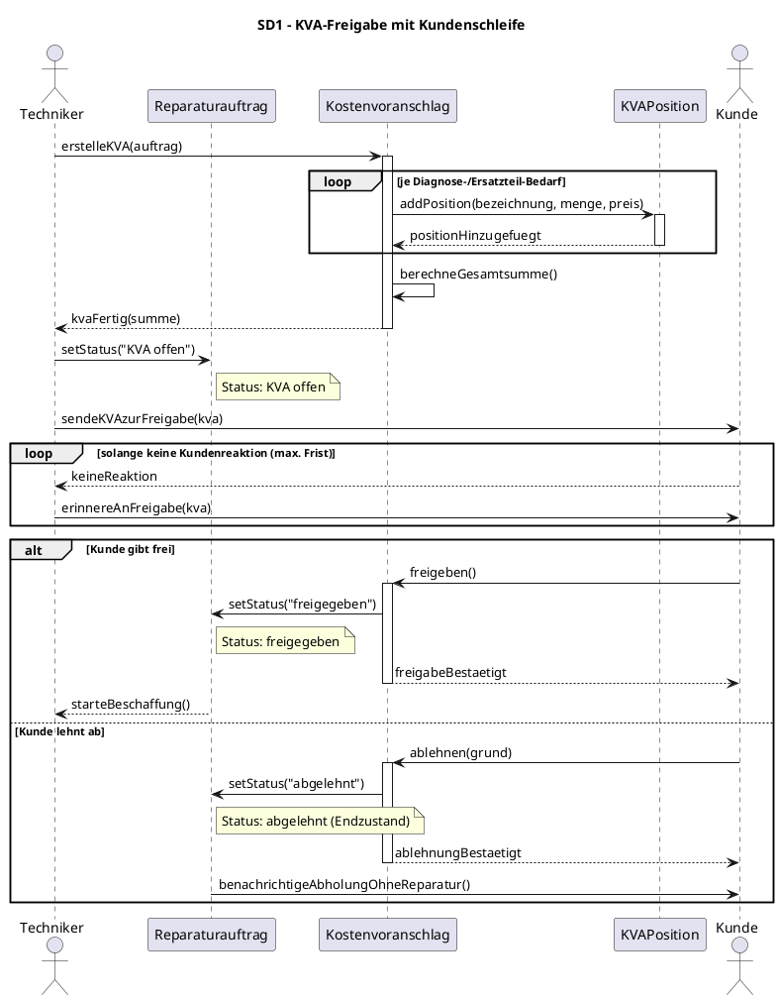
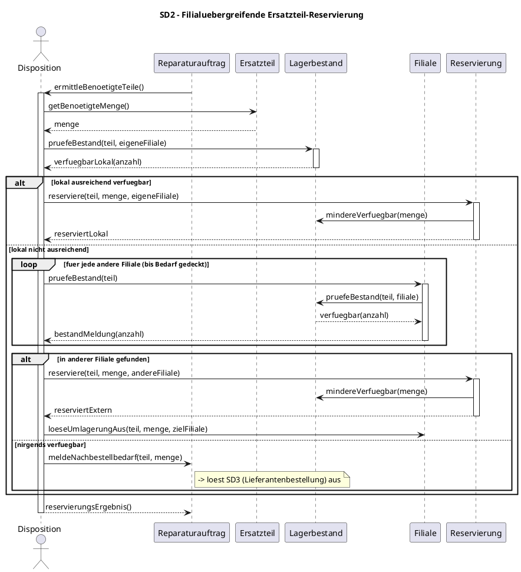
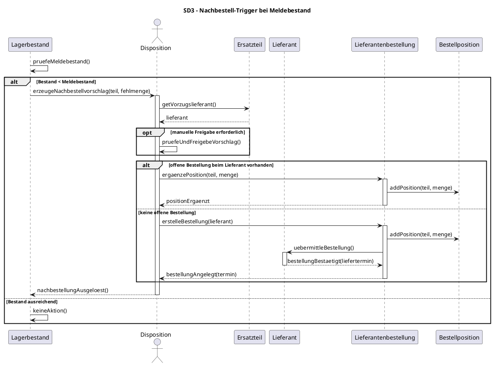
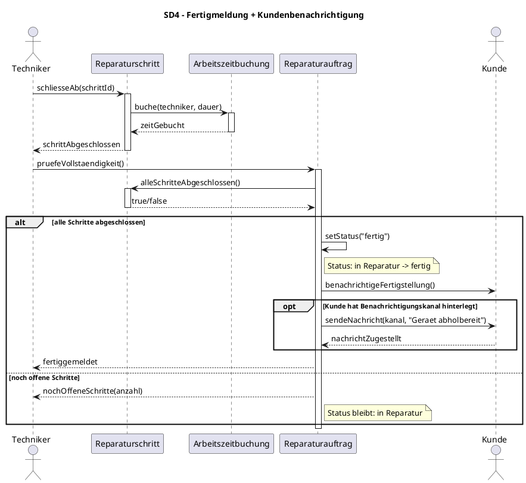
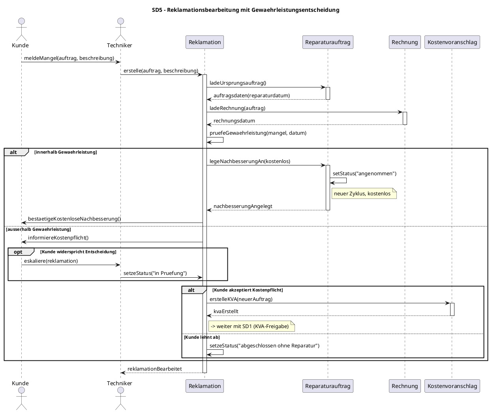

# RepairFlow — Teil 4: Sequenzdiagramme (UML)

> **Werkzeug-Hinweis:** Der Kurs zeichnet UML mit **Visual Paradigm**. Der PlantUML-Code unten ist dein Konstruktionsplan — er ist valide/renderbar (z. B. auf plantuml.com oder via PlantUML-Plugin) und du überträgst die Interaktionen 1:1 ins finale VP-Sequenzdiagramm.

## Konventionen (Konsistenz mit Klassen- und Use-Case-Diagramm)

- **Lebenslinien = Klassen** aus dem Klassendiagramm (Teil: Klassen). Exakt gleiche Namen: `Kunde`, `Reparaturauftrag`, `Geraet`, `Diagnose`, `Kostenvoranschlag`, `KVAPosition`, `Reparaturschritt`, `Arbeitszeitbuchung`, `Techniker`, `Filiale`, `Ersatzteil`, `Lagerbestand`, `Reservierung`, `Lieferantenbestellung`, `Bestellposition`, `Lieferant`, `Rechnung`, `Reklamation`.
- **Rollen/Pools (BPMN)** = die menschlichen/externen Akteure `Kunde`, `Techniker` (Werkstatt), `Disposition` (Ersatzteil-Disposition), `Lieferant`. In den Sequenzdiagrammen erscheinen sie als `actor`.
- **Statusautomat des Reparaturauftrags** (durchgängig referenziert): `angenommen → in Diagnose → KVA offen → freigegeben | abgelehnt → Teile bestellt → in Reparatur → fertig → abgeholt`. Statuswechsel werden per `note` an der `Reparaturauftrag`-Lebenslinie markiert.
- **Kombinierte Fragmente:** `alt` (Verzweigung), `opt` (optional), `loop` (Wiederholung) — wie in der Aufgabe gefordert.

Die fünf gewählten Use Cases sind die interaktionsreichsten (kein reiner Getter/Setter):

| Nr | Use Case (identisch zum UC-Diagramm) | Kernfragment |
|----|--------------------------------------|--------------|
| 1  | KVA freigeben/ablehnen (Kunde) mit Freigabeschleife | `loop` + `alt` |
| 2  | Ersatzteil-Verfügbarkeit prüfen + reservieren (filialübergreifend) | `loop` + `alt` |
| 3  | Nachbestellvorschlag bei Meldebestand → Lieferantenbestellung auslösen | `opt` + `alt` |
| 4  | Auftrag fertigmelden + Kunde benachrichtigen (Statuswechsel) | `alt` + `opt` |
| 5  | Reklamation bearbeiten mit Gewährleistungsentscheidung | `alt` (verschachtelt) |

---

## SD 1 — KVA-Freigabe mit Kundenschleife (Use Case: „KVA freigeben/ablehnen")

**Kontext:** Der `Kostenvoranschlag` ist erstellt (Status `KVA offen`). Der `Kunde` muss ihn freigeben oder ablehnen. Die `loop` bildet die Erinnerungs-/Warteschleife ab (Kunde reagiert nicht sofort); das `alt` verzweigt in **freigegeben** (→ Statuswechsel, weiter Richtung Teile/Reparatur) vs. **abgelehnt** (Auftrag endet, Gerät zur Abholung).

**Prüfungserklärung:** Der Statusautomat springt genau an der `alt`-Verzweigung: `freigegeben` triggert die Ersatzteil-Beschaffung (Übergang zu SD 2), `abgelehnt` ist ein Endzustand — das Gerät wird unrepariert zur Abholung freigegeben. Die `loop` modelliert die reale Erinnerungsschleife, kein Fachschritt.

---

## SD 2 — Filialübergreifende Ersatzteil-Reservierung (Use Case: „Ersatzteil-Verfügbarkeit prüfen" + „Ersatzteil reservieren")

**Kontext:** Nach KVA-Freigabe braucht der `Reparaturauftrag` bestimmte `Ersatzteil`e. Die `Disposition` prüft den `Lagerbestand` zuerst in der **eigenen Filiale**, dann per `loop` über die **anderen Filialen**. Das `alt` verzweigt: lokal vorhanden → sofort reservieren; nur extern vorhanden → in anderer Filiale reservieren + Umlagerung; nirgends → Trigger Lieferantenbestellung (Übergang zu SD 3).

**Prüfungserklärung:** Zwei verschachtelte Fragmente: das äußere `alt` (lokal vs. nicht lokal), im Else-Zweig die `loop` über die Filialen und ein inneres `alt` (extern gefunden vs. nirgends). Wichtig für die Klausur: die `Reservierung` ist eine eigene Klasse (Zuordnung Auftrag ↔ Ersatzteil ↔ Filiale), sie mindert den `Lagerbestand.verfuegbar`, ohne ihn physisch abzubuchen — die Abbuchung passiert erst bei Einbau (SD-übergreifend).

---

## SD 3 — Nachbestell-Trigger bei Meldebestand → Lieferantenbestellung (Use Case: „Nachbestellvorschlag bei Meldebestand" + „Lieferantenbestellung auslösen")

**Kontext:** Sinkt der `Lagerbestand` eines `Ersatzteil`s unter den Meldebestand (z. B. nach einer Reservierung aus SD 2), erzeugt die `Disposition` einen Nachbestellvorschlag. Das `opt` bildet die optionale manuelle Freigabe ab; das `alt` unterscheidet, ob eine offene `Lieferantenbestellung` beim `Lieferant` bereits existiert (dann Position ergänzen) oder eine neue angelegt wird.

**Prüfungserklärung:** Der Trigger ist ereignisgesteuert — der `Lagerbestand` selbst prüft gegen den Meldebestand. Klausur-Falle: das innere `alt` (offene Bestellung ergänzen vs. neu anlegen) verhindert Sammelbestellungs-Dubletten. `Bestellposition` ist die n:m-Auflösung zwischen `Lieferantenbestellung` und `Ersatzteil` — konsistent zum Klassendiagramm.

---

## SD 4 — Reparatur fertigmelden + Kundenbenachrichtigung + Statuswechsel (Use Case: „Auftrag fertigmelden + Kunde benachrichtigen")

**Kontext:** Der `Techniker` schließt den letzten `Reparaturschritt` ab und bucht die `Arbeitszeitbuchung`. Das `alt` prüft, ob alle Schritte abgeschlossen sind (nur dann Statuswechsel auf `fertig`); das `opt` deckt den bevorzugten Benachrichtigungskanal ab (E-Mail/SMS je nach Kundenpräferenz).

**Prüfungserklärung:** Der Statuswechsel `in Reparatur → fertig` ist an eine Bedingung geknüpft (`alt`: alle Schritte fertig) — das verhindert eine verfrühte Fertigmeldung. Die `Arbeitszeitbuchung` hängt am einzelnen `Reparaturschritt`, nicht am Auftrag — so bleibt die Nachkalkulation je Schritt möglich (konsistent zum Klassendiagramm).

---

## SD 5 — Reklamationsbearbeitung mit Gewährleistungsentscheidung (Use Case: „Reklamation bearbeiten")

**Kontext:** Der `Kunde` meldet nach Abholung einen Mangel. Der `Techniker` legt eine `Reklamation` an und prüft, ob sie in die **Gewährleistung** fällt. Verschachteltes `alt`: (a) innerhalb Gewährleistung → kostenlose Nachbesserung (neuer Reparaturauftrag-Zyklus); (b) außerhalb → neuer kostenpflichtiger `Kostenvoranschlag`; das innere `opt` deckt eine strittige Fallweiterleitung ab.

**Prüfungserklärung:** Kern ist die **Gewährleistungsentscheidung** (`pruefeGewaehrleistung` anhand Reparaturdatum vs. Frist). Der Gewährleistungsfall startet einen neuen, kostenlosen Auftragszyklus (Status zurück auf `angenommen`); der Nicht-Gewährleistungsfall mündet in einen neuen `Kostenvoranschlag` und schleift damit zurück in SD 1. Das verschachtelte `alt` + `opt` bildet die Eskalationsmöglichkeit ab — typische Klausur-Anforderung „mehrere Fragmenttypen kombinieren".

---

## Konsistenz-Check (für die Abgabe)

- Alle Lebenslinien-Namen kommen 1:1 aus dem Klassendiagramm.
- Jeder Statuswechsel (`note right of RA`) liegt auf einem Wert des Statusautomaten.
- Cross-Referenzen zwischen den Diagrammen sind explizit markiert (SD1↔SD2, SD2→SD3, SD5→SD1).
- Rollen (`actor`) = BPMN-Pools: `Kunde`, `Techniker`, `Disposition`, `Lieferant`.
